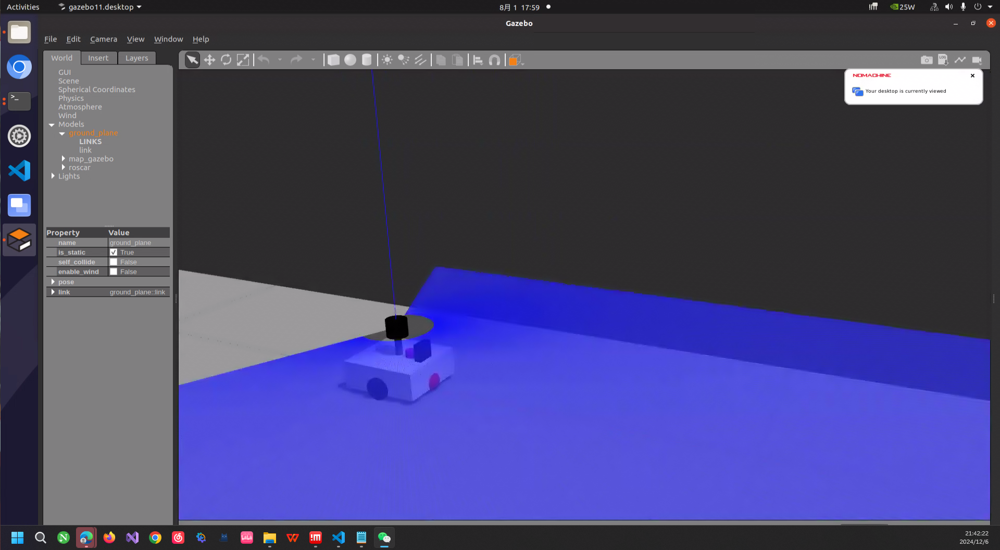
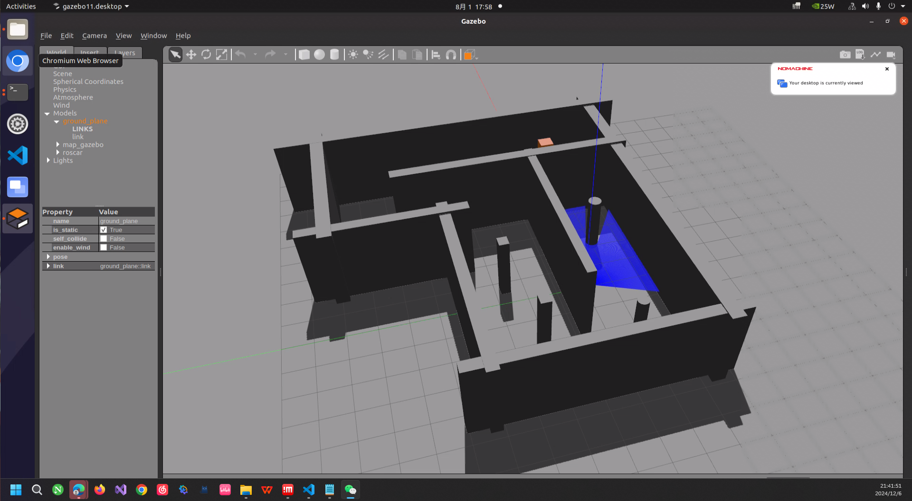
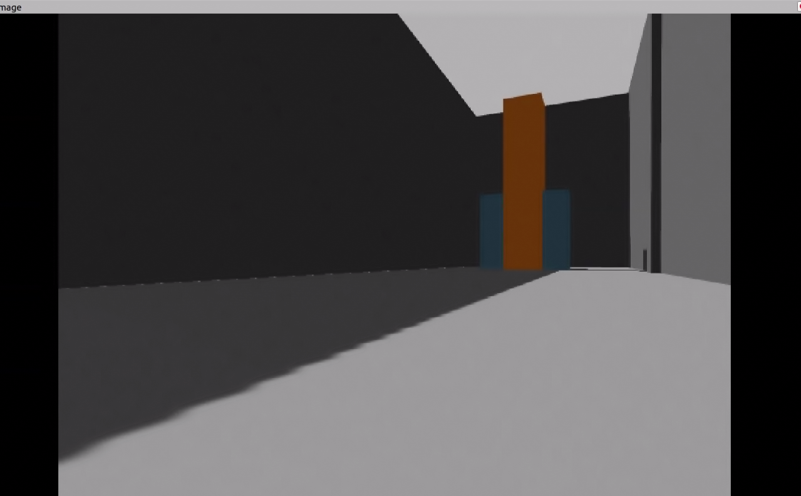

参考浙江大学lidar_IMU_calib-modified
## 一、环境配置
***Ubuntu20.04  ROS1-noetic***

### 1.编译
##### 1.首先在一个合适的位置打开终端，执行命令
```git clone https://github.com/iamgod-king/SDK_roscar.git```
##### 2.随后编译
```catkin_make```

### 2.运行launch
#####  1.source工作空间环境(每次在新的终端窗口都要source一下)
```source path/to/your/workspace/SDK_roscar/devel/setup.bash```
  **例如**
  ```source ~/SDK_roscar/devel/setup.bash```
##### 2.启动地图和机器人的gazebo
```roslaunch roscar roscar_gazebo.launch```
##### 3.启动rviz和雷达点云图
```roslaunch roscar roscar_move.launch```
##### 4.启动camera和imu的订阅节点
```roslaunch roscar camera_imu.launch```

### 完毕

#### 注：
##### 1.可能会需要安装 Arbotix，Arbotix 是一款控制电机、舵机的控制板，并提供相应的 ros 功能包
```sudo apt-get install ros-noetic-arbotix```
##### 2.可能会需要安装键盘控制机器人的ROS包
```sudo apt install ros-noetic-teleop-twist-keyboard```

## 二、任务描述

该SDK制作耗时7天，从机器人xacro模型、世界gazebo模型到传感器的纯手搓ROS1小车仿真。由左右两个驱动轮、一个万向轮、一个2D激光雷达、一个普通单目摄像头、一个imu构成。



### 本次考核概述

本次考核主要面对无人机的二维定点问题，随着光流技术日益成熟，电赛主办方更倾向于选择难以分辨的地面来干扰光流定点效果，而雷达方案则更加稳定。

在室内定位中，以 IMU 为主，同时雷达点云数据辅助融合。

---

#### 系统组件

- **摄像头节点**：`camera_subscriber`
- **IMU 节点**：`imu_subscriber`
- **机器人控制**：接收 `/cmd_vel` 消息，控制底盘的线速度和角速度来进行运动。

---

#### 参数设置

##### 摄像头
- **帧率**：30 Hz
- **分辨率**：640x480

##### 雷达
- **频率**：10 Hz
- **测量范围**：0.1 m 至 10 m
- **测量弧度**：-1 至 1 弧度

##### IMU
- **频率**：100 Hz


##### 任务一：键盘控制机器人平移与旋转，并运动至能够看到橙蓝柱子的位置

1. 请用键盘发布 `/cmd_vel` 消息，控制机器人平移与旋转。
2. 运动至能够看到橙蓝柱子的位置。
3. 请简单录制并提交一个键盘控制视频。

---

##### 任务二：使用 OpenCV 实时显示转化成 HSV 格式后的视频，并保存

1. 使用 OpenCV，在 `camera_subscriber.cpp` 中编写代码，实时显示转化为 HSV 格式后的视频。
2. 保存任务一中从原点移动至看到橙蓝柱子的 HSV 视频。
3. 提交 OpenCV 保存的视频。

---

##### 任务三（难）：融合 IMU 和雷达点云数据，并在终端发布自己位置

1. 融合 IMU 和雷达点云数据。
2. 在终端发布自己位置。
3. 请在网上认真搜集资料并移植一个适合的算法。
4. 请简单录制运行过程的视频。

---

## 提交要求

1. 提交视频与整个 `roscar` 包代码，并发送至邮箱：`yinzhe23@bupt.edu.cn`。
2. 提示：
   - SDK 已配好 `rviz.config`、`map.world`、`xacro`、`model`，主要在 `camera_subscriber.cpp`、`imu_subscriber.cpp` 编写代码，并编写新的 CPP 与 Launch 文件。
   - 由于 Gazebo 问题，可能会出现障碍物悬浮在空中的情况，请在 QQ 群中提问或私信解决。
##主要修改在station.cpp中
rostopic echo /fused_odom
即可看到定位信息
##定位信息示例
---
header: 
  seq: 863
  stamp: 
    secs: 2288
    nsecs: 167000000
  frame_id: "map"
child_frame_id: "base_footprint"
pose: 
  pose: 
    position: 
      x: -0.7523115108627599
      y: -2.3216253909241376
      z: 0.0
    orientation: 
      x: 0.0
      y: -0.0
      z: -0.9806257284421074
      w: -0.19589073668090123
  covariance: [0.0, 0.0, 0.0, 0.0, 0.0, 0.0, 0.0, 0.0, 0.0, 0.0, 0.0, 0.0, 0.0, 0.0, 0.0, 0.0, 0.0, 0.0, 0.0, 0.0, 0.0, 0.0, 0.0, 0.0, 0.0, 0.0, 0.0, 0.0, 0.0, 0.0, 0.0, 0.0, 0.0, 0.0, 0.0, 0.0]
twist: 
  twist: 
    linear: 
      x: 0.0
      y: 0.0
      z: 0.0
    angular: 
      x: 0.0
      y: 0.0
      z: 0.0
  covariance: [0.0, 0.0, 0.0, 0.0, 0.0, 0.0, 0.0, 0.0, 0.0, 0.0, 0.0, 0.0, 0.0, 0.0, 0.0, 0.0, 0.0, 0.0, 0.0, 0.0, 0.0, 0.0, 0.0, 0.0, 0.0, 0.0, 0.0, 0.0, 0.0, 0.0, 0.0, 0.0, 0.0, 0.0, 0.0, 0.0]
---
消息内容解析
Header:

seq: 消息序列号，标识这是第863条消息。
stamp: 消息的时间戳，表明这条消息是在仿真时间2288秒加上167000000纳秒时发布的。
frame_id: 消息的参考坐标系是“map”，表示这是相对于地图坐标系的位置和速度。
Pose:

position: 机器人的位置坐标，x坐标为-0.7523115108627599，y坐标为-2.3216253909241376，z坐标为0.0（假设是平坦地面，z坐标通常为0）。
orientation: 机器人的方向，使用四元数表示。x、y、z分量为0.0，w分量为-0.19589073668090123，这表示机器人相对于地图坐标系的朝向。
Covariance:

pose: 位姿的协方差矩阵，全部为0，这通常意味着位姿估计没有不确定性，或者协方差没有被正确设置。
Twist:

linear: 机器人的线性速度，x、y、z分量都为0，表示机器人没有在移动。
angular: 机器人的角速度，x、y、z分量都为0，表示机器人没有旋转。
##代码解读
定义状态结构体
struct State {
    double x, y, theta;
    double cov[3][3];
};

State state;
定义一个State结构体来存储机器人的位置（x, y）、方向（theta）和协方差矩阵（cov）
定义发布器
ros::Publisher fused_pub;
声明一个ros::Publisher对象fused_pub，用于发布融合后的里程计数据。
主函数
int main(int argc, char **argv) {
程序的入口点，argc和argv是从命令行传递的参数。
ros::init(argc, argv, "station");
初始化ROS节点，节点名为“station”。
    if (!ros::master::check()) {
        ROS_ERROR("ROS master is not running.");
        return 1;
    }
    检查ROS Master是否在运行，如果不在运行，输出错误并退出程序。
    ros::NodeHandle nh;
    创建一个ros::NodeHandle对象nh，用于处理节点的名称空间和通信。
        state.x = 0.0;
    state.y = 0.0;
    state.theta = 0.0;
    for (int i = 0; i < 3; ++i) {
        for (int j = 0; j < 3; ++j) {
            if (i == j) state.cov[i][j] = 1.0;
            else state.cov[i][j] = 0.0;
        }
    }
    初始化状态向量和协方差矩阵，将协方差矩阵的对角线元素设为1（表示完全确定），其他元素设为0
        ros::Subscriber scan_sub = nh.subscribe<sensor_msgs::LaserScan>("scan", 1000, update);
        订阅名为“scan”的话题，消息类型为sensor_msgs::LaserScan，队列大小为1000，回调函数为update。
        ros::Subscriber odom_sub = nh.subscribe<nav_msgs::Odometry>("odom", 1000, predict);
        订阅名为“odom”的话题，消息类型为nav_msgs::Odometry，队列大小为1000，回调函数为predict。
fused_pub = nh.advertise<nav_msgs::Odometry>("fused_odom", 1000);
创建一个发布器fused_pub，发布到名为“fused_odom”的话题，消息类型为nav_msgs::Odometry，队列大小为1000。
ros::Rate loop_rate(10);
设置循环频率为10Hz。
while (ros::ok()) {
进入ROS的主循环，只要ROS系统处于OK状态，循环就会继续。


        nav_msgs::Odometry fused_odom;
        fused_odom.header.stamp = ros::Time::now();
        fused_odom.header.frame_id = "map";
        fused_odom.child_frame_id = "base_footprint";
创建一个nav_msgs::Odometry消息fused_odom，并设置其时间戳、参考坐标系和子坐标系。


        fused_odom.pose.pose.position.x = state.x;
        fused_odom.pose.pose.position.y = state.y;
        fused_odom.pose.pose.orientation = tf::createQuaternionMsgFromYaw(state.theta);
设置fused_odom消息的位置和姿态。


        fused_pub.publish(fused_odom);
发布融合后的里程计数据。


        ros::spinOnce();
        loop_rate.sleep();
    }
在每次循环中调用ros::spinOnce()来处理回调函数，然后调用loop_rate.sleep()来保持循环频率。


    return 0;
}
程序结束，返回0。

回调函数

void update(const sensor_msgs::LaserScan::ConstPtr& scan) {
定义处理激光扫描数据的回调函数update。


    double measured_x = scan->ranges[0] * cos(scan->angle_min);
    double measured_y = scan->ranges[0] * sin(scan->angle_min);
计算激光扫描的测量值。


    state.x = 0.8 * state.x + 0.2 * measured_x;
    state.y = 0.8 * state.y + 0.2 * measured_y;
使用简单的加权平均方法更新状态向量。


    state.cov[0][0] *= 0.8;
    state.cov[1][1] *= 0.8;
更新协方差矩阵。


void predict(const nav_msgs::Odometry::ConstPtr& odom) {
定义处理里程计数据的回调函数predict。


    state.x += odom->pose.pose.position.x;
    state.y += odom->pose.pose.position.y;
    state.theta += odom->pose.pose.orientation.z;
使用里程计数据更新状态向量。
